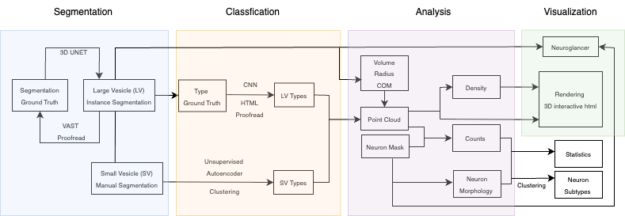

# VesicleEM: Deep Learning Toolkit for Synaptic Vesicle Analysis

[](https://opensource.org/licenses/MIT)
[](https://www.python.org/)
[](https://pytorch.org/)

VesicleEM is a deep learning toolkit for synaptic vesicle analysis in electron microscopy data, providing tools for segmentation, classification, and statistical analysis of vesicles, along with web-based proofreading tools and visualization capabilities.



# Key Features

- **Automated Segmentation**: Deep learning-based instance and semantic segmentation of vesicles in EM data
- **Multi-class Classification**: Supervised learning for vesicle type identification and morphological analysis
- **Unsupervised Learning**: VAE-based embeddings for discovering vesicle patterns and clustering
- **Interactive Proofreading**: Web-based tools for quality control and manual correction of automated results
- **Statistical Analysis**: Comprehensive tools for vesicle distribution analysis and morphometric studies
- **Multi-modal Visualization**: 2D/3D visualization with Neuroglancer, Plotly, PyVista, and custom HTML viewers

# Supported Data Formats

VesicleEM supports various data formats commonly used in connectomics:

- [HDF5](https://www.hdfgroup.org/solutions/hdf5/) - Primary format for volumetric data
- [Neuroglancer Precomputed](https://github.com/google/neuroglancer/tree/master/src/datasource/precomputed) - Web-based visualization
- [VAST](https://lichtman.rc.fas.harvard.edu/vast/) - Annotation and proofreading
- PNG/TIFF - 2D image tiles and exports
- Parquet/CSV - Tabular data for analysis and statistics

# Module Overview

## Core Processing Modules

### `ves_seg/` - Vesicle Segmentation
**Supervised deep learning for vesicle instance and semantic segmentation**

- **Training**: Configure and train models using PyTorch Connectomics
  ```bash
  python scripts/main.py --config-base configs/00_base.yaml --config-file configs/bcd_config.yaml
  ```
- **Inference**: Apply trained models to new datasets
  ```python
  from tools.process import do_inference
  do_inference(image_path, prediction_path, config_files, checkpoint_path)
  ```
- **Evaluation**: Compute precision, recall, and adapted RAND metrics
- **Visualization**: Neuroglancer integration for 3D viewing

### `ves_cls/` - Vesicle Classification
**Supervised deep learning for vesicle type classification and morphological analysis**

- **Multi-class Classification**: Distinguish between different vesicle types
- **Feature Extraction**: Automated morphometric feature computation
- **Model Architectures**: StandardNet CNN with customizable depth
- **Evaluation Metrics**: Accuracy, precision, recall, and F1-score analysis
- **HTML Visualization**: Interactive web interface for result inspection & proofreading

### `ves_unsup/` - Unsupervised Learning
**VAE-based embedding and clustering for vesicle pattern discovery**

- **Variational Autoencoders**: Learn latent representations of vesicle morphology
- **Dimensionality Reduction**: Compress high-dimensional vesicle features
- **Clustering Analysis**: Discover vesicle subtypes without labeled data

### `ves_ncls/` - Morphological Clustering
**Advanced clustering analysis of vesicle morphological features**

- **Mixed Data Handling**: Process numerical and categorical features
- **Gower Distance**: Handle heterogeneous feature types
- **Hierarchical Clustering**: Agglomerative clustering with complete linkage
- **Visualization**: Dendrograms and MDS plots for cluster interpretation
  ```python
  # Run cluster analysis
  jupyter notebook ves_ncls/cluster_analysis.ipynb
  ```

## Analysis and Visualization

### `ves_analysis/` - Statistical Analysis
**Comprehensive tools for vesicle distribution analysis**

- **Spatial Analysis**: Vesicle distribution patterns and clustering
- **Morphometric Analysis**: Size, shape, and volume measurements
- **Comparative Studies**: Cross-condition and cross-sample analysis

### `ves_vis/` - Multi-modal Visualization
**Comprehensive visualization suite for multiple use cases**

- **Data Conversion**: Transform annotations and their corresponding metadata between different commonly used formats (Parquet, OBJ, PLY, etc.)
  ```bash
  python scripts/conversion/dfGen.py mapping_files/ --output vesicles.parquet
  ```
- **3D Mesh Generation**: Create meshes from masks and coordinate data
  ```bash
  python scripts/conversion/neuron_mesh_gen.py neuron_mask.h5 neuron.obj
  python scripts/conversion/vesicle_mesh_gen.py vesicles.parquet vesicles.obj
  ```
- **Interactive Plotting**: Plotly-based dashboards and charts
- **3D Visualization**: PyVista for advanced 3D rendering
- **Neuroglancer Integration**: Web-based volumetric visualization
- **HTML Viewers**: Custom web interfaces for result presentation

# Installation

## Requirements

To install all dependencies, use the central `requirements.txt` file:

```bash
# Clone the repository
git clone https://github.com/PytorchConnectomics/vesicleEM.git
cd vesicleEM

# Install all dependencies
pip install -r requirements.txt
```

# License

VesicleEM is released under the MIT License. See LICENSE file for details.
